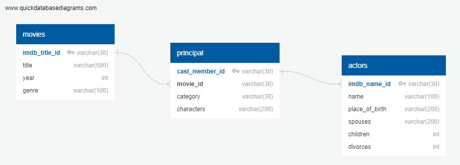

# Courtney Gomez   |   Lisa Harrell   |   Carlos Quiroz   |   Gerald Watts III

## INTRODUCTION

The goal of this project is to illustrate Extract Transform Load (ETL) using Excel, Python and SQL.  ETL is a process commonly done in computing, which takes raw data, cleans it and stores it for later use.  The extraction phase targets and retrieves the data.  Transform manipulates and cleans the data. Then load stores the data, typically in a data warehouse. After ETL is completed, the data can be used for analytics to help achieve business objectives.  

## MAIN OBJECTIVES

 - Collect data  from various maintained sources
 - Perform cleaning, merging, filtering, normalization and aggregations of all the data being used
 - Upload the files in a database in preparation for more thorough analysis
 - Formulate ideas on what types of questions or analyses can be drawn from the datasets

## DATA SOURCES AND DESCRIPTIONS

We obtained 3 data files from the IMDB Movies Extensive dataset located at https://www.kaggle.com. The datasets consist of movies with more than 100 votes as of 01/01/2020.
 - The movies dataset includes 85,855 movies with attributes such as movie description, average rating, number of votes, genre, etc.
 - The names dataset includes 297,705 cast members with personal attributes such as birth details, death details, height, spouses, children, etc.
 - The title principals dataset includes 835,513 cast members roles in movies with attributes such as IMDb title id, IMDb name id, order of importance in the movie, role, and characters played.

## DATA EXTRACTION

For the data extraction phase, we extracted data from 3 csv files.  In Jupyter Notebook, the data was imported by using the csv module which can read csv data.  The file paths were saved and the module can import data by connecting through the file path locations.  We developed the design of our database using quickdatabasediagrams.com.  On this website, you can name tables and columns and assign data types for your database.  Each table has a primary key and we linked the tables together using primary and foreign keys. After the schema was designed, we exported the file and uploaded it into PGAdmin to create the structure of the database.

## DATA TRANSFORMATION (Python & Pandas)  

During the transformation phase, we performed various data cleaning tactics to get the data clean before loading into the database. None of the datasets requred normalization because they are small.
 - Dataset1: movie.csv
   - Dropped one corrupted row
   - Dropped columns except imdb_title_id, title, year, and genre
 - Dataset2: actors.csv
   - Removed all columns except imdb_name_id, name, spouses, children and divorces
   - Checked and dropped all null values
   - Checked and dropped duplicate values in the imdb_name_id column
 - Dataset3: principal.csv
   - Checked and dropped duplicate values
   - Checked and dropped all null values

## DATA LOADING (PGAdmin SQL)

 - Created primary & foreign keys
 - Created a new database called IMDb_db
 - Wrote a Schema to create the tables in the database and setting primary keys for each dataset
 - Imported all three normalized datasets successfully in SQL server 
 - Generated some queries to show how the data can be useful to analysts in the future
 - Created ERD Diagram that shows how all the different normalized tables are related 

## DATA USE CASES

From these datasets, the following are some useful queries that can be generated by the future analyst(s)
 - What are all movies and the cast members?
 - Is there a correlation between divorces and amount of work?
 - Is there acorrelation between place of birth and genre?
 - Which birth place produces the most people that work in movies?
